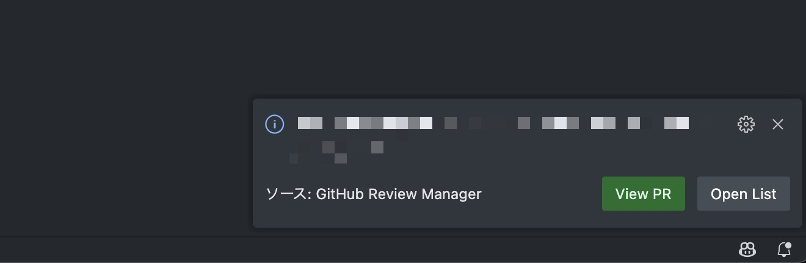

# 📋 GitHub Review Manager

A Visual Studio Code extension that helps you monitor and manage GitHub pull request review requests with automatic updates, visual priority indicators, and smart notifications.

[](https://marketplace.visualstudio.com/items?itemName=Sado4.github-review-manager)
[](https://marketplace.visualstudio.com/items?itemName=Sado4.github-review-manager)

## ✨ Features

- **🎯 Smart Priority Display** - Visual priority indicators with emojis based on review urgency
- **👤 Author Avatars** - See reviewer profile pictures for quick identification
- **⏰ Time Tracking** - Shows time elapsed since last activity with urgency levels
- **🔔 Real-time Notifications** - Instant notifications with sound alerts for new review requests
- **📊 Detailed Information** - Rich tooltips with comprehensive PR details
- **🎮 Quick Actions** - One-click access to PRs and settings
- **📱 Compact Design** - Optimized for narrow sidebars with essential information
- **🔄 Auto-refresh** - Configurable update intervals (minimum 60 seconds)
- **📍 Multi-view Support** - Available in both Activity Bar and Explorer sidebar
- **🤖 AI Review Integration** - Right-click PR items to request comprehensive AI code reviews
- **🛡️ Safe File Management** - Automatic cleanup with bulletproof safety for generated review files

## 🎨 Visual Priority System

The extension uses intelligent emoji indicators to show review urgency at a glance:

- 🆕 **New** - Same day (just requested)
- ⚠️ **Attention** - 1-2 days old
- 🔥 **Urgent** - 3-6 days old
- 🚨 **Critical** - 1 week+ old

### Display Format
```
🔥 Fix authentication bug    [username/repo] [Draft]
⚠️ Add new feature          [username/repo] [⚡]
🆕 Update documentation     [username/repo]
```

- `[Draft]` - Pull request is still in draft mode
- `[⚡]` - Merge conflicts detected

## 🔑 Why Classic Tokens?

This extension is designed for **multi-repository review management** and works best with **Classic Personal Access Tokens**:

### ✅ **Classic Token Advantages**
- **🌍 Universal Access**: One token accesses ALL your repositories (personal, organizations, private)
- **🚀 Zero Configuration**: Just select `repo` scope - no manual repository selection needed
- **🏢 Multi-Organization**: Seamlessly works across all organizations you belong to
- **⚡ Simple Setup**: Generate once, use everywhere

### ❌ **Fine-grained Token Limitations**  
- **📍 Single Target**: Each token works for only ONE organization or personal account
- **📝 Manual Selection**: Must individually select every repository you want access to
- **🔄 Multiple Tokens**: Need separate tokens for each organization
- **🔮 Prediction Required**: Must anticipate which repositories you'll review in

**Bottom Line**: Review requests come from anywhere in your GitHub ecosystem. Classic tokens ensure you never miss a review request from any repository you have access to.

## 🚀 Quick Start

1. **Install the extension** from the VS Code Marketplace
2. **Configure your GitHub token**:
   - Click the 🔑 "Set Token" button in the GitHub Review Manager view
   - Generate a **Classic Personal Access Token** with `repo` scope:
     - **Advantage**: Access to ALL repositories (personal, organization, private) with a single token
     - **Simplicity**: No need to select individual repositories
     - **Multi-organization support**: Works across all organizations you have access to
   - [Generate a Classic token here](https://github.com/settings/tokens/new?scopes=repo&description=GitHub%20Review%20Manager)
3. **View your review requests** in the Activity Bar or Explorer sidebar

### Token Comparison

| Feature | Classic Token (Recommended) | Fine-grained Token |
|---------|----------------------------|-------------------|
| **Repository Access** | ✅ ALL repositories (personal + organizations) | ❌ Must select each repository individually |
| **Multi-organization** | ✅ Access across all organizations | ❌ One organization per token |
| **Setup Complexity** | ✅ Simple - just select `repo` scope | ❌ Complex - manual repository selection |
| **Use Case** | ✅ Perfect for review managers | ❌ Better for specific project access |
| **Token Management** | ✅ One token for everything | ❌ Multiple tokens needed |

**Why Classic tokens work better for review management:**
- Review requests come from various repositories across different organizations
- Fine-grained tokens require you to predict and pre-select every repository
- Classic tokens with `repo` scope provide seamless access to all your reviewable content

## 📸 Screenshots

### Review Request Sidebar

*Review requests are displayed in a clean sidebar view with priority indicators and author avatars. Click any item to instantly open the PR in your browser.*

### Smart Notifications

*Get instant notifications with sound alerts when new review requests arrive. Quick action buttons let you view the PR or open the full list.*

### Status Bar Integration

*The status bar displays your pending review count with smart color coding - yellow for normal requests, red for urgent ones (3+ days old).*

## ⚙️ Configuration

| Setting | Description | Default |
|---------|-------------|---------|
| Token | Classic Personal Access Token with `repo` scope (recommended for full repository access) | Use "Set Token" button |
| `githubReviewManager.refreshInterval` | Auto-refresh interval in seconds | `300` (5 minutes) |
| `githubReviewManager.showNotifications` | Show notifications for new review requests | `true` |
| `githubReviewManager.playSound` | Play sound when new review requests arrive | `true` |
| `githubReviewManager.groupByRepository` | Group review requests by repository in tree view | `true` |
| `githubReviewManager.repositoryFilter` | **🔍 Filter to specific repositories only** - Show review requests only from specified repositories (e.g., `["mycompany/web-app", "personal/project"]`). Leave empty to show all repositories. | `[]` |

### 🔍 Repository Filter Examples

The `repositoryFilter` setting allows you to focus on specific repositories. Here are common use cases:

#### Focus on work projects only:
```json
{
  "githubReviewManager.repositoryFilter": [
    "mycompany/frontend",
    "mycompany/backend",
    "mycompany/mobile-app"
  ]
}
```

#### Monitor personal projects:
```json
{
  "githubReviewManager.repositoryFilter": [
    "myusername/personal-blog",
    "myusername/side-project"
  ]
}
```

#### Mixed work and personal:
```json
{
  "githubReviewManager.repositoryFilter": [
    "company/main-app",
    "opensource/library",
    "personal/portfolio"
  ]
}
```

**💡 Quick Setup**: Go to VS Code Settings (`Cmd+,`) → Search "GitHub Review Manager" → "Repository Filter" and add your repositories one by one!

## 🤖 AI Review Feature

### Overview
Generate comprehensive AI review prompts for any pull request directly from VS Code. The extension creates intelligent, context-aware prompts that work with any AI tool (Claude, ChatGPT, Gemini, etc.).

### How to Use
1. **Right-click** on any PR item in the GitHub Review Manager
2. **Select "Generate AI Review Prompt"** from the context menu
3. **AI review prompt is automatically copied to clipboard**
4. **Paste into your preferred AI tool** for instant comprehensive review

### What's Included in AI Review Prompts
The extension automatically gathers and formats:

- **📋 PR Information**: Title, repository, author, status, and statistics
- **📝 PR Description**: Complete description and context from GitHub
- **🔍 Code Changes**: Clean diff showing actual changes (merge commits excluded)
- **🎯 Smart Filtering**: Automatically filters out merge commits to focus on actual code changes

### Language Detection
The extension intelligently detects the primary language used in PR titles and descriptions:
- **🇯🇵 Japanese**: Generates review prompts in Japanese with appropriate context
- **🇺🇸 English**: Uses English prompts for international projects
- **🧠 Smart Detection**: Uses character analysis and linguistic patterns for accuracy

### Key Features

#### 🎯 **Smart Merge Commit Filtering**
- Automatically excludes merge commits from diff analysis
- Works with any base branch (main, develop, feature branches)
- Focuses on actual code changes, not branch synchronization

#### 📋 **Universal AI Tool Compatibility**
- Works with Claude, ChatGPT, Gemini, and any AI tool
- Clean, formatted prompts ready for immediate use
- No dependency on specific CLI tools or APIs

#### 🌍 **Intelligent Language Support**
- Auto-detects Japanese vs English content
- Generates appropriate prompts in the detected language
- Perfect for international development teams

### Example Review Prompt Structure

```markdown
# PR Review Request

## PR Information
- **Title**: Fix authentication bug
- **Repository**: mycompany/webapp
- **Author**: developer-name
- **Status**: Ready for Review

## Changes Overview
- **Files Changed**: 5
- **Additions**: 45
- **Deletions**: 12

## Code Changes
```diff
[Clean diff with actual changes, merge commits excluded]
```

## Review Request
Please provide a comprehensive code review for this pull request...
```

### Integration Benefits
- **🎯 Universal Compatibility**: Works with any AI tool or service
- **🌍 Multi-language**: Supports both Japanese and English workflows  
- **⚡ Efficient**: One-click from PR list to ready-to-use prompt
- **🧹 Clean Output**: Focused on actual changes, not merge noise
- **📱 Simple**: Just copy, paste, and get instant AI reviews

## 🎯 How It Works

The extension uses the GitHub Search API to find pull requests where you're requested as a reviewer:
- Searches for: `type:pr state:open review-requested:@me`
- Sorts by most recent activity (`updated` time) for relevant prioritization
- Fetches detailed information including author avatars, draft status, and change statistics
- Updates automatically based on your configured refresh interval
- Shows notifications with sound alerts for genuinely new review requests

## 📊 Rich Information Display

### Hover Tooltips
Hover over any review request to see comprehensive details:

```markdown
## 🔥 PR #123: Fix authentication bug

📅 PR Created: 2024-01-10 14:30:00
⏰ Last Activity: 2d ago (2024-01-18 16:45:00)

📁 Repository: username/awesome-project
👤 Author: developer-name

✅ Status: Ready for Review
⚠️ Mergeable: Has conflicts

📊 Changes:
- ➕ 45 additions
- ➖ 12 deletions
- 📄 5 files modified
- 💬 3 review comments

🔗 Open PR in Browser
```

### Smart Time Tracking
- Priority based on **last activity time** (more accurate than creation time)
- Shows both relative time ("2d ago") and exact timestamps
- Automatically removes completed reviews from the list

## 🔧 Commands & UI

### Toolbar Actions
- 🔄 **Refresh Review Requests** - Manually refresh the list
- 🔑 **Set GitHub Token** - Securely configure your GitHub access token
- 🗑️ **Clear GitHub Token** - Remove stored token from secure storage

### Context Actions
- 🌐 **Open PR in Browser** - Open selected PR in your default browser
- 🤖 **Generate AI Review Prompt** - Generate comprehensive AI review prompts for any AI tool

## 🎨 UI Components

### Activity Bar View
A dedicated sidebar showing all your pending review requests with:
- 👤 **Author avatars** for quick visual identification
- 🎯 **Priority emojis** indicating urgency level
- 📱 **Compact layout** optimized for narrow sidebars
- 🔄 **Smart sorting** by most recent activity

### Explorer Integration
Review requests also appear in the Explorer sidebar when you have pending items.

### Status Bar
Clean and intuitive status indicator:
- 📊 **Simple count display**: `$(git-pull-request) 3`
- 🎨 **Smart color coding**:
  - 🟡 Yellow - Any pending reviews
  - 🔴 Red - Reviews 3+ days old (urgent attention needed)
- 👆 **Click to open** review list or configuration
- 📋 **Detailed tooltip**: Urgency breakdown on hover

### Smart Notifications
- 🔔 **Instant alerts** when new reviews are requested
- 🔊 **Cross-platform sound** notifications
- 🎮 **Quick actions**: "View PR" and "Open List"
- ⏰ **Perfect timing**: sound plays with popup display

## 🔐 Privacy & Security

- Your GitHub token is stored securely in VS Code's Secret Storage (encrypted)
- All API requests are made directly to GitHub - no third-party servers involved  
- The extension only accesses pull requests where you're specifically requested as a reviewer
- AI review files are safely managed with bulletproof deletion patterns - only extension-generated files are affected by auto-cleanup

## 🐛 Troubleshooting

### "GitHub token not configured" error
Click the 🔑 "Set Token" button and enter a Classic Personal Access Token with `repo` scope for full repository access.

### No review requests showing
- Verify your token has the correct permissions
- Check that you actually have pending review requests on GitHub
- Try refreshing manually using the refresh button

### Network/API errors
- Check your internet connection
- Verify your GitHub token is still valid
- GitHub API rate limits may apply - the extension respects these limits

## 🤝 Contributing

Contributions are welcome! Please feel free to submit issues and pull requests.

## 📄 License

This project is licensed under the MIT License.

## 🔗 Links

- [GitHub Repository](https://github.com/Sado4/github-review-manager)
- [VS Code Marketplace](https://marketplace.visualstudio.com/items?itemName=Sado4.github-review-manager)
- [Report Issues](https://github.com/Sado4/github-review-manager/issues)
